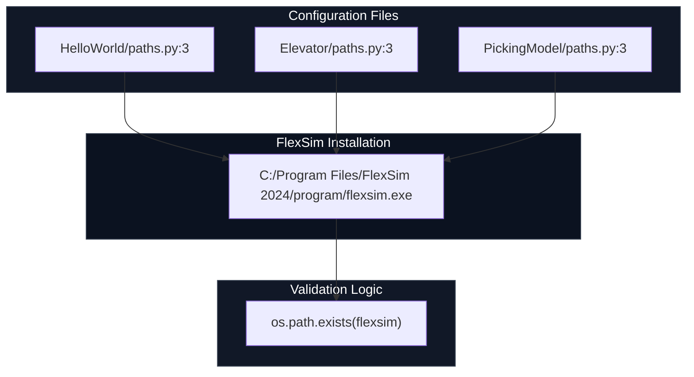

## FlexSim configuration overview

This diagram shows how configuration files point to the FlexSim executable and how the validation logic checks for its existence.

Notes:
- Replace the executable path with your actual FlexSim install path if different.
